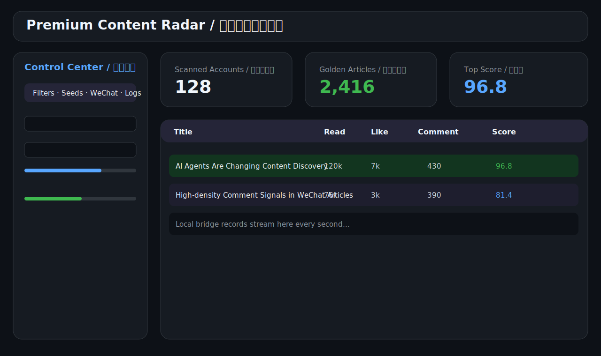

# Premium Content Radar



Premium Content Radar is a local-first Qt 6 desktop application for discovering, storing, scoring, and exporting high-value WeChat Official Account content. It is designed for lawful user-controlled ingestion pipelines: the app never ships credentials, cookies, private traffic data, or remote collection services.

## What it does

- Loads content providers from a runtime plugin directory.
- Accepts local JSON metrics through a localhost-only bridge.
- Stores publisher seeds and article metrics in SQLite.
- Scores articles with engagement, comment density, and publishing frequency.
- Provides a dark desktop dashboard with filters, preview, seed management, logs, and exports.
- Produces CSV and JSON exports for downstream analysis.
- Includes CI, packaging scripts, Docker build support, release workflow, and documentation gates.

## Current production boundary

The desktop app is production-ready as a local analysis and ingestion host. Real WeChat data requires a user-owned lawful data source that sends the documented JSON payloads to the localhost bridge. The repository provides the bridge contract and local smoke tooling; it does not bypass platform controls or embed account secrets.

## Quick start

```bash
cmake -S . -B build -DCMAKE_BUILD_TYPE=Release
cmake --build build -j2
ctest --test-dir build --output-on-failure
QT_QPA_PLATFORM=offscreen ./build/premium-content-radar --bridge-smoke
./build/premium-content-radar
```

## Release package

```bash
VERSION=1.0.1 ./scripts/package-linux.sh
```

The Linux package contains the binary, plugin, documentation, preview assets, and checksums.

## Documentation

English documentation:

- [User Guide](docs/en/USER_GUIDE.md)
- [Installation Guide](docs/en/INSTALL.md)
- [Developer Guide](docs/en/DEVELOPER_GUIDE.md)
- [Plugin Guide](docs/en/PLUGIN_GUIDE.md)
- [Production Runbook](docs/en/PRODUCTION_RUNBOOK.md)
- [Local Proxy Adapter Guide](docs/en/LOCAL_PROXY_ADAPTER.md)
- [WeChat Ingestion Options A/B/C](docs/en/WECHAT_INGESTION_OPTIONS_ABC.md)

Chinese documentation is separated under `docs/README.zh-CN.md` and `docs/zh-CN/`.

## Quality gates

```bash
./scripts/verify-all.sh
```

This runs build, tests, self-test, localhost bridge smoke test, screenshot generation, secret scan, requirement audit, and documentation language split audit.

## Security and compliance

- The bridge listens on `127.0.0.1` only.
- Unknown endpoints are rejected.
- No credentials are committed.
- ADB automation is disabled by default.
- Runtime settings are stored in the user's local config directory.

See [Security](SECURITY.md) for reporting guidance.

## License

MIT License. See [LICENSE](LICENSE).
